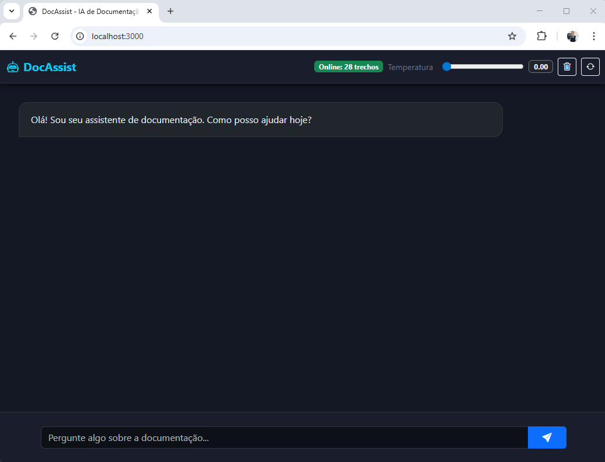
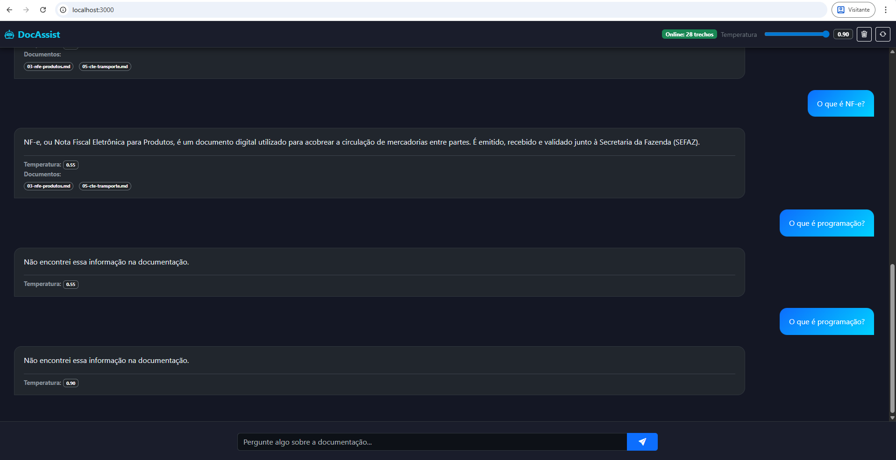
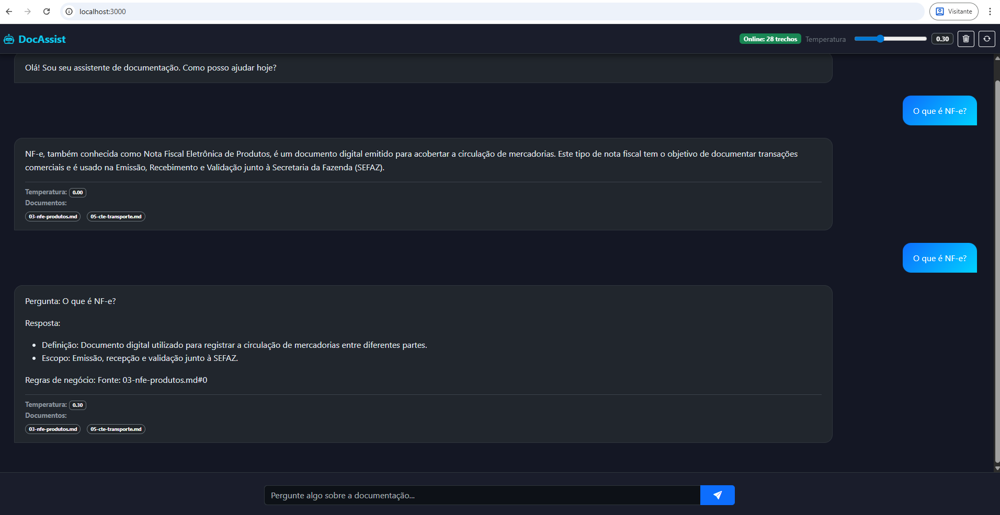

# 🧪 RAG + LM Studio — Interface e Laboratório

Este projeto demonstra um sistema de **RAG (Retrieval-Augmented Generation)** rodando localmente com LM Studio.

---

# 🧠 O que é RAG

RAG (Retrieval-Augmented Generation) é uma abordagem que combina:

- 🔎 **Busca (retrieval)** em documentos
- 🤖 **Geração de resposta** por um modelo de IA

Em vez da IA responder apenas com o que “sabe”, ela:

1. Busca informações relevantes na documentação
2. Usa esse conteúdo como contexto
3. Gera uma resposta baseada nesses dados

👉 Isso reduz alucinação e aumenta a confiabilidade.

---

# 💻 Ambiente

- CPU: i7-13650HX  
- RAM: 32 GB  
- GPU: RTX 3050 6GB  
- Execução: 100% local  

---

# 🖥️ Interface do sistema

## 🔹 Tela inicial

O sistema inicia com uma interface simples para interação com a documentação.

---

## 🔹 Consulta fora da documentação

Quando a pergunta não existe na base:

👉 O sistema responde com segurança:  
**"Não encontrei essa informação na documentação."**

---

## 🔹 Temperatura ajustada

Demonstração do impacto da temperatura:

- 🔹 Baixa temperatura → respostas mais precisas
- 🔹 Alta temperatura → maior variação / fallback

---

# ⚙️ Como o sistema funciona

1. Pergunta do usuário  
2. Busca de contexto na documentação  
3. Envio para modelo (LM Studio)  
4. Validação (grounding)  
5. Fallback (se necessário)  

---

# 🧠 Explicação do projeto

Este projeto foi desenvolvido em **Node.js** com o objetivo de mostrar que:

> não é necessário utilizar IA paga para diversos cenários práticos.

Ele funciona como um **chatbot de documentação**, onde:

- os dados ficam locais
- a busca é feita na própria documentação
- o modelo ajuda a montar a resposta
- o sistema garante segurança com fallback

---

# 📏 Regras de arquitetura

## ✔ A IA não é a fonte única
A aplicação controla o fluxo.  
Se a IA falhar → entra fallback.

## ✔ Contexto limpo
Remove ruído (FAQ, palavras-chave, etc.) antes de enviar ao modelo.

## ✔ Resposta validada
A resposta precisa:
- estar no contexto
- ser útil
- não ser inventada

## ✔ Temperatura controlada
Define estilo da resposta, não o conhecimento.

---

# 🤖 Modelos testados

- qwen2.5-coder-0.5b-instruct - contém 0,5 bilhões de parâmetros ❌ (fraco, alucina)
- qwen2.5-1.5b-instruct - contém 1,5 bilhões de parâmetros ⚠️ (médio)
- qwen2.5-3b-instruct - contém 3 bilhões de parâmetros ✅ (melhor equilíbrio)

---

# 🌡️ Temperatura

| Temperatura | Comportamento |
|------------|--------------|
| 0.0–0.3 | preciso |
| 0.4–0.7 | variável |
| 0.7–0.9 | fallback |

---

# 💡 Ideia principal

Este projeto prova que:

✔ É possível rodar IA local  
✔ Sem custo por requisição  
✔ Sem depender de API externa  

Casos ideais:

- chatbot interno
- documentação técnica
- suporte interno
- consulta de regras

---

# 🖥️ Requisitos por modelo

### 0.5B
- RAM: ~2GB
- GPU: opcional

### 1.5B
- RAM: ~4GB
- GPU: opcional

### 3B
- RAM: 4–8GB
- GPU: recomendada (4GB VRAM)

---

# ☁️ Rodar em VPS

Também é possível rodar em servidor:

- VPS simples → modelos menores
- VPS com GPU → modelo 3B
- servidor dedicado → produção

---

# 🚀 Resultado

✔ Sistema confiável  
✔ Sem alucinação relevante  
✔ Respostas seguras  
✔ Execução local  

